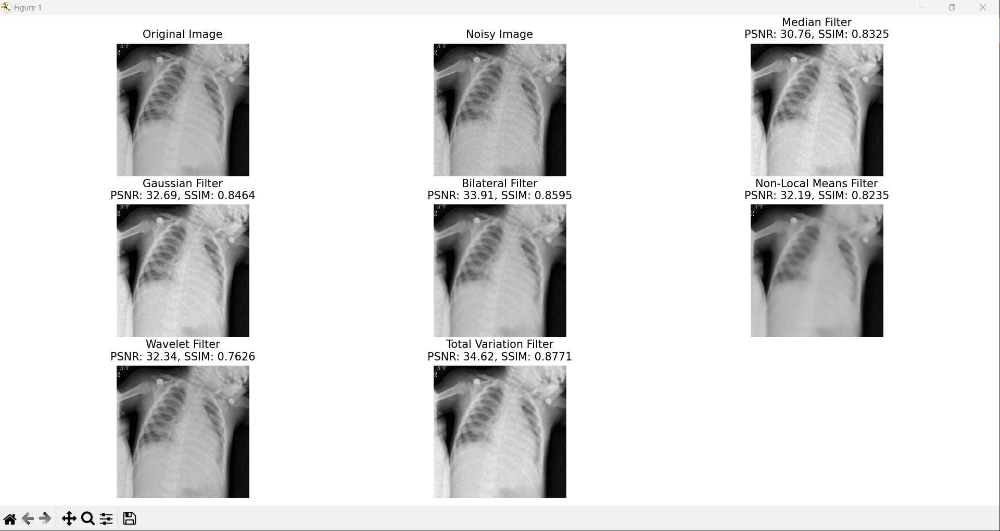

# Výsledky

## poisson_intensity_0.1
Nastavení
```python
    'Median': cv2.medianBlur(image, 5),
    'Gaussian': cv2.GaussianBlur(image, (5, 5), 0),
    'Bilateral': cv2.bilateralFilter(image, 9, 75, 75),
    'Non-Local Means': cv2.fastNlMeansDenoising(image, None, 30, 7, 21),
    'Wavelet': denoise_wavelet(image, method='BayesShrink', mode='soft'),
    'Total Variation': denoise_tv_chambolle(image, weight=0.1)
```
### Vzorek 639

