# Výsledky

```python
# Nastavení
    'Median': cv2.medianBlur(image, 5),
    'Gaussian': cv2.GaussianBlur(image, (5, 5), 0),
    'Bilateral': cv2.bilateralFilter(image, 9, 75, 75),
    'Non-Local Means': cv2.fastNlMeansDenoising(image, None, 30, 7, 21),
    'Wavelet': denoise_wavelet(image, method='BayesShrink', mode='soft'),
    'Total Variation': denoise_tv_chambolle(image, weight=0.1)
```

## poisson_intensity_0.1
### Vzorek 639

### Vzorek 655


## poisson_intensity_0.2
### Vzorek 753
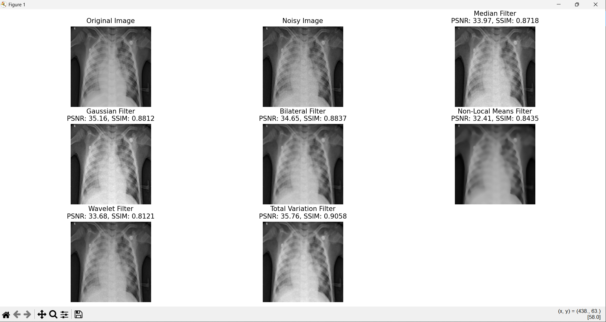
### Vzorek 732
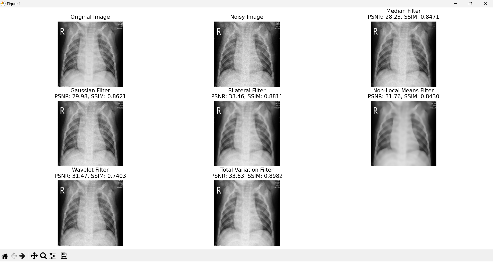

## poisson_intensity_0.3
### Vzorek 809
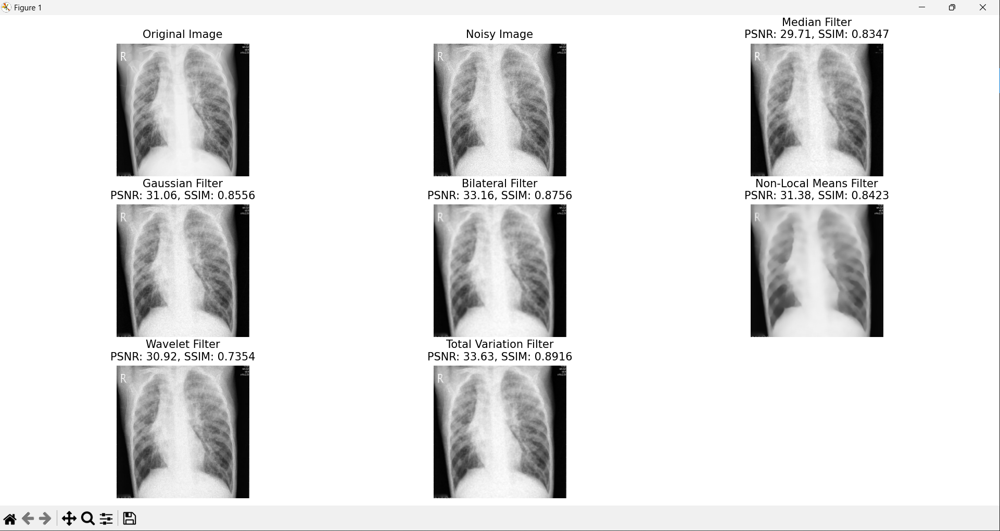
### Vzorek 843
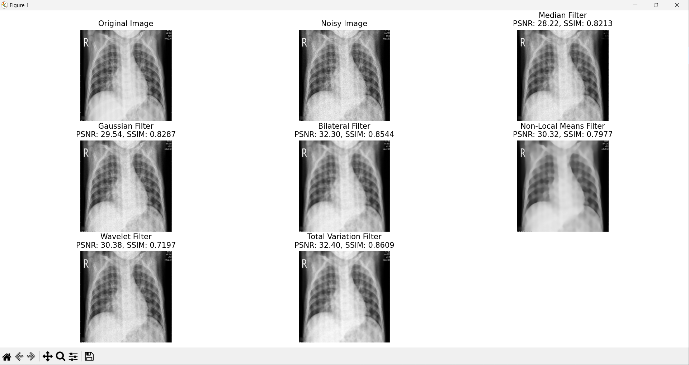

## salt_and_pepper_speckle_intensity_0.01_0.1
### Vzorek 1125
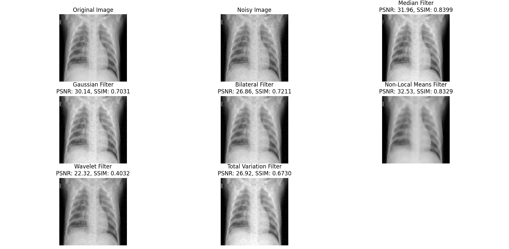
### Vzorek 1169


## salt_and_pepper_speckle_intensity_0.03_0.3
### Vzorek 1057
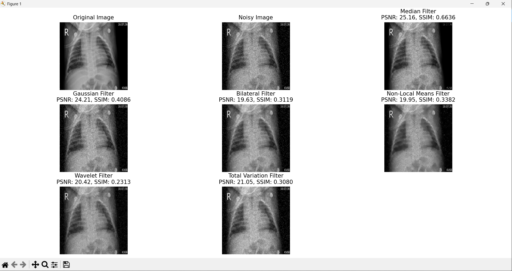
### Vzorek 1007
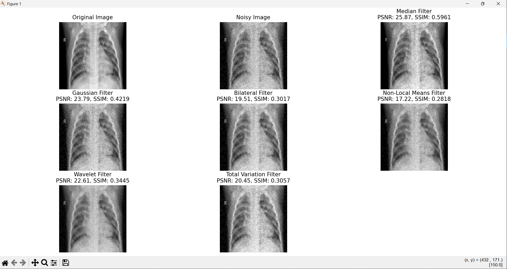

## salt_and_pepper_speckle_intensity_0.05_0.2
### Vzorek 972

### Vzorek 949
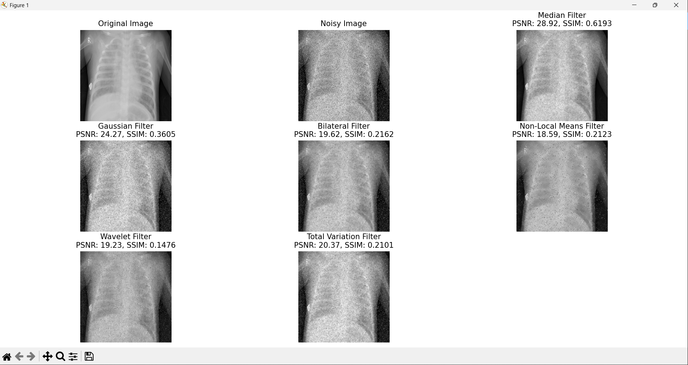

## salt_pepper_intensity_0.01
### Vzorek 331
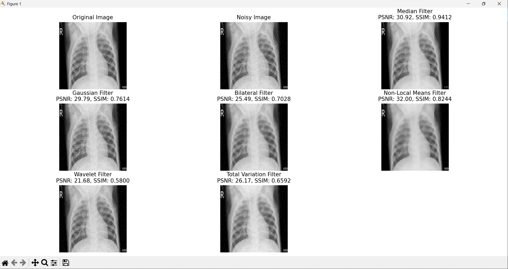
### Vzorek 358


## salt_pepper_intensity_0.03
### Vzorek 496

### Vzorek 465
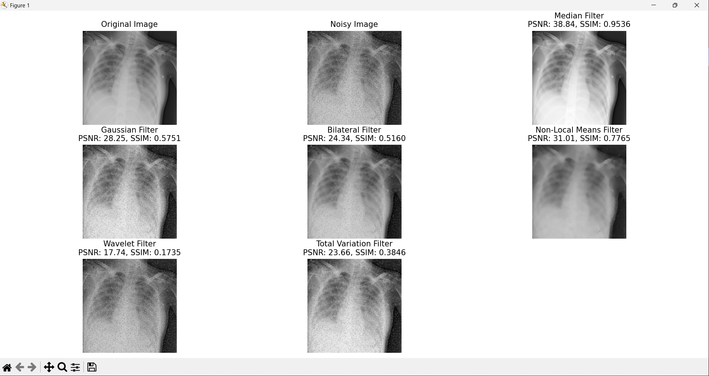

## salt_pepper_intensity_0.05
### Vzorek 594
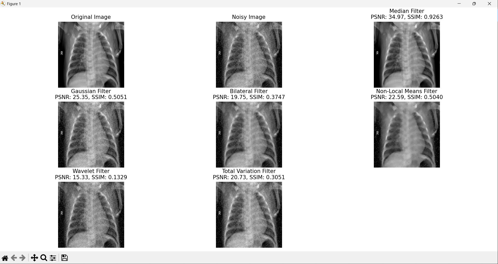
### Vzorek 511
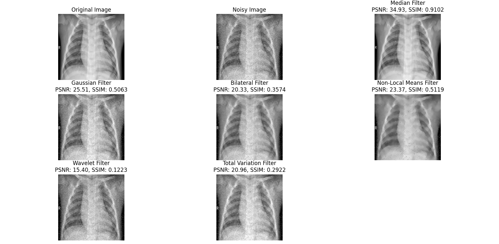

## speckle_intensity_0.1
### Vzorek 106
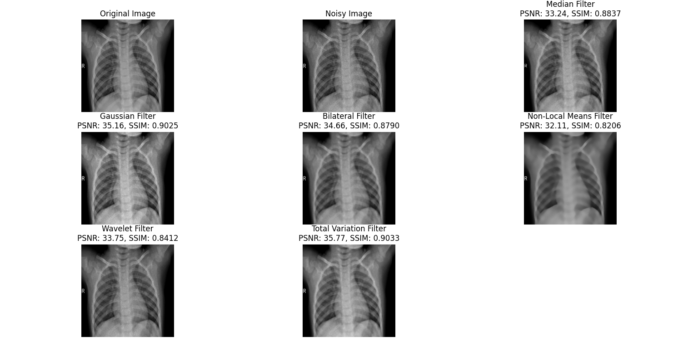
### Vzorek 155


## speckle_intensity_0.05
### Vzorek 81
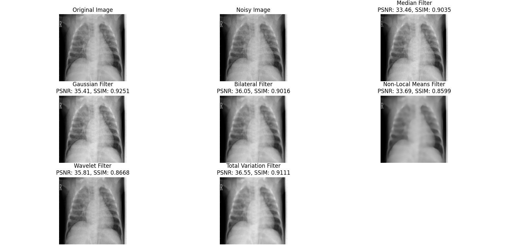
### Vzorek 5
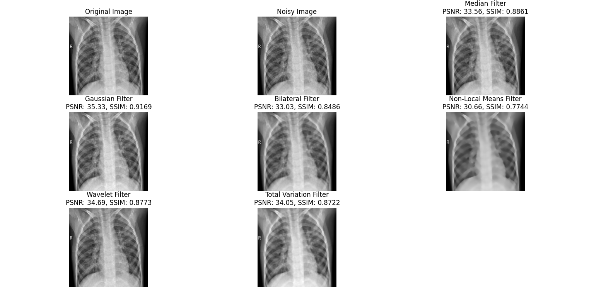

## speckle_intensity_0.15
### Vzorek 267

### Vzorek 201
